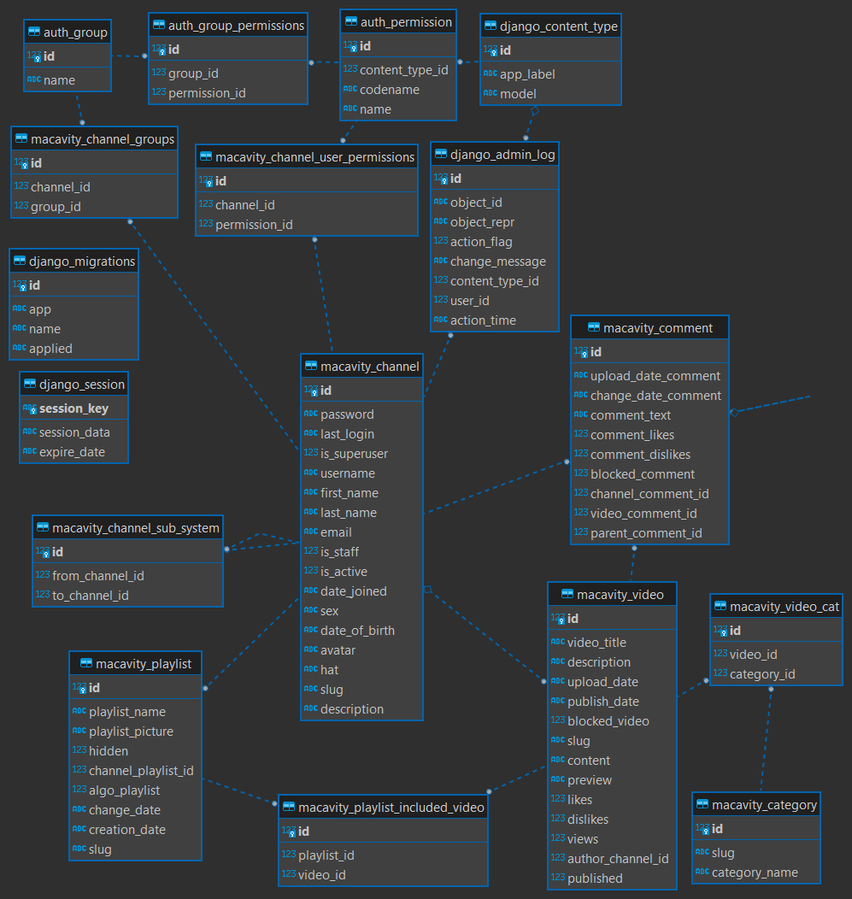

HELLO GITHUB!

So what is this project?

    -this is my pet project
    -youtube like videohosting

ENV

    -python 3.11
    -django
    -django-debug-toolbar

BD SCHEMA

HOW TO RUN

    -from VideoCat run python manage.py makemigrations macavity
    -from VideoCat run python manage.py migrate
    -python manage.py runserver

WHY?

    -I decided to make this project, becouse it looked chalenging and interesting for me
    -And also I'm a bit tired of rounded youtube design with overloaded inteface

ALSO

    -there are almost no comments in html files, becouse I think html speaks for itself
    -there are some unimplemented funciuns(recomendation algoritms, async js refreshing video stats and channel stats, and so on)
        -I probably wont implement this functions, becouse I don't think, that it can improve my django skill right now
    -maybe there will be an update to DRF, and I'll change db to postgresql
    -maybe I will ad redis cashe, but I don't think, that cashe can take plase in dynamic pages
    -maybe I will run this project from linux vm, to earn some expirience with nginx

    -but for now this project is not going to change(maybe), if it will change, I will delete this lines from readme)

Thank you for reading, I'll be glad to get some comments on this project, maybe about some issues, if they are
Good luck!
